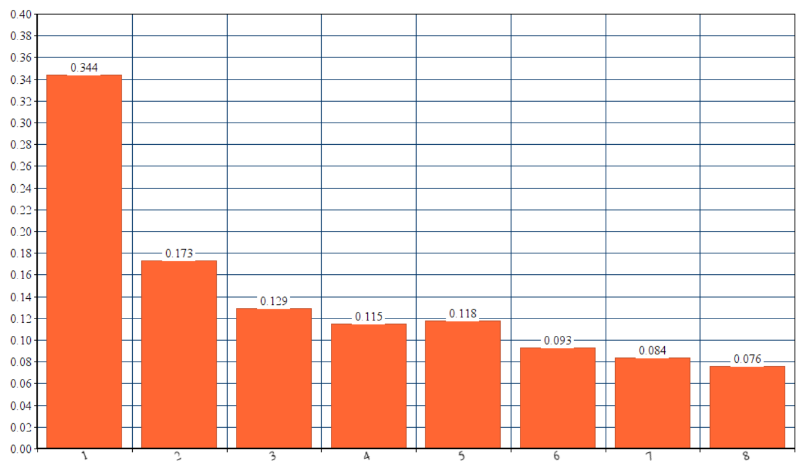

# Отчет по лабораторной работе №1

## Постановка задачи

* Напишите программу на языке C для вычисления скалярного произведения двух векторов типа ``double``;
* Размер векторов выберите таким образом, чтобы они занимали половину оперативной памяти;
* Модифицируйте данный алгоритм с помощью прагм OpenMP и выполните программу с использованием разного количества потоков;
* Вычислите время выполнения и проанализируйте полученные результаты.

## Выполнение

### Cтруктура ``Vector``

Хранит в себе динамический массив типа ``double`` и минимальное/максимальное допустимое значение элементов вектора.

### Вспомогательные функции структуры ``Vector``

Конструктор, деструктор, рандомизатор, вычисление скалярного произведения и функции, вычисляющие время выполнения всех операций над структурой

Ниже приводится код функции для поиска скалярного произведения, рандомизации структуры и определение структуры ``Vector``:

````C
typedef struct {
    double* value;
    size_t size;

    double min, max;
} vector;

static long long i = 0ll;

void vector_random(const vector* vec) {
    if (vec)
        for (i = 0ll; i < vec->size; i++) {
            vec->value[i] = rand_double(vec->min, vec->max);
        }
    }
}

double scalar(const vector* first, const vector* second) {
    double result = 0.0;

    if (first->size != second->size)
        return 0.0;

    for (i = 0; i < first->size; i++) {
        result += first->value[i] * second->value[i];
    }

    return result;
}

````

Модифицируем функции прагмами из библиотеки OpenMP и дадим возможность выбирать точное количество потоков, которые будут принимать участие в работе программы, с помощью функций ``	omp_set_dynamic(0)``, которая уберёт возможность изменять количество используемых потоков по ходу программы, и ``omp_set_num_threads()``, которая укажет количество используемых потоков.

Теперь функция ``scalar()`` будет выглядеть следующим образом:

````C
static long long i = 0ll;

double scalar(const vector* first, const vector* second) {
    double result = 0.0;

    if (first->size != second->size)
        return 0.0;

    #pragma omp parallel for default(none) shared(first, second), private(i), reduction(+: result)
    for (i = 0; i < first->size; i++) {
        result += first->value[i] * second->value[i];
    }

    return result;
}
````

## Анализ результатов

Запуск приложения выполняется из консоли. Для запуска приложению требуется
указать три аргумента:

- количество потоков, которое нужно использовать для выполнения программы;
- минимальное значение для элементов вектора;
- максимальное значение для элементов вектора.

Существенное ускорение, очевидно, достигается при использовании всех
"физических потоков" (1 поток на 1 ядро). Значительный прирост
имеет место аж до использования 4 потоков включительно, далее начинается
понижение производительности, однако оно на уровне погрешности.

Самое существенное ускорение было получено после перехода из
однопоточного режима выполнения программы в режим использование двух
потоков (уменьшение затрат времени с 344 мс до 173 мс).


